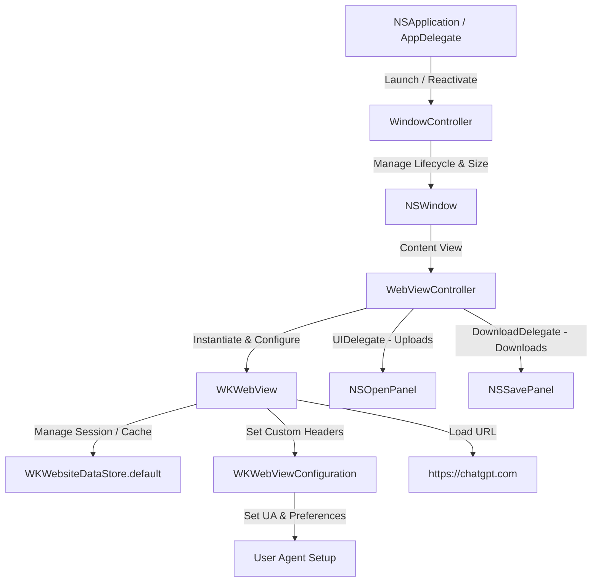

# 2026-05-29 DeskGPT Standalone macOS Application Design

## 1. 개요 (Overview)
본 문서는 `https://chatgpt.com`을 macOS 환경에서 독립된 프리미엄 데스크톱 애플리케이션으로 실행하기 위한 네이티브 macOS 앱 개발 사양을 정의합니다. 

사용자가 번거롭게 브라우저 탭을 찾지 않고, Dock 및 Launchpad에서 즉시 단독 프로그램처럼 DeskGPT를 실행 및 사용할 수 있도록 합니다. 웹뷰 차단 우회, 로그인 쿠키 보존, 창 상태 기억, 브라우저 단축키 등의 사용자 편의 기능을 완벽하게 갖춘 초경량 네이티브 앱 구현을 목표로 합니다.

---

## 2. 핵심 목표 및 가치 (Core Objectives)
1. **성능 극대화 (Lightweight & High Performance)**: Electron이나 Chromium 기반 래퍼 대비 메모리 및 가상 메모리 소비를 90% 이상 절감하며, 즉각 실행(Instant Launch)되는 Native App 개발.
2. **세션 완벽 유지 (Session Persistence)**: 브라우저 캐시, 쿠키, LocalStorage, IndexedDB를 앱 종료 후에도 유지하여 재로그인 번거로움 방지.
3. **봇 감지 우회 (Bot-Detection Bypass)**: 최신 macOS Safari 엔진을 탑재하고 표준 Chrome/Safari User-Agent를 수동 설정하여 Cloudflare/OpenAI 봇 차단 메커니즘 원천 방지.
4. **macOS 네이티브 사용자 경험 (Native UX)**:
   - 마지막 창 위치 및 크기 기억.
   - 창 닫기(`Cmd+W`) 시 세션을 날리지 않고 백그라운드 전환 (Dock 클릭 시 재개).
   - 브라우징 및 줌 단축키 내장.
   - DeskGPT 전용 고해상도 앱 아이콘 탑재.
   - **[Premium] 항상 위에 유지 (Always on Top)** 플로팅 모드 제공.
   - **[Premium] 파일 업로드 및 다운로드 네이티브 대화상자** 완벽 연동.

---

## 3. 시스템 아키텍처 (System Architecture)

### 3.1 구성 요소 및 관계 (Mermaid)

### 3.2 핵심 컴포넌트 설계

1. **`AppDelegate`**
   - macOS 앱의 전체 수명 주기(Lifecycle)를 관리합니다.
   - `applicationDidFinishLaunching` 시점에 `WindowController`를 초기화하고 창을 화면에 띄웁니다.
   - `applicationShouldHandleReopen`을 구현하여, 사용자가 Dock 아이콘을 클릭하거나 앱을 다시 실행할 때 닫혀 있던 창을 다시 열거나 포커싱합니다.

2. **`DeskGPTWindowController` (NSWindowController)**
   - `NSWindow` 객체를 관리하며, 창의 속성을 정의합니다.
   - `window.setFrameAutosaveName("DeskGPTMainWindow")`를 통해 창의 크기와 2D 좌표를 macOS 시스템에 영구 저장합니다.
   - `NSWindowDelegate`를 채택하여, 창이 닫힐 때(`windowShouldClose`) 앱이 종료되지 않고 숨겨지도록(Hide/OrderOut) 처리합니다.
   - 항상 위에 유지(Floating) 창 레벨(`window.level = .floating`) 설정을 위한 토글 API를 노출합니다.

3. **`DeskGPTViewController` (NSViewController & WKNavigationDelegate & WKUIDelegate & WKDownloadDelegate)**
   - `WKWebView` 인스턴스를 생성하고 뷰 레이아웃 전체를 가득 채웁니다.
   - `WKWebViewConfiguration` 설정:
     - `websiteDataStore`를 `WKWebsiteDataStore.default()`로 지정하여 쿠키, 세션, DB 보존.
     - `preferences.setValue(true, forKey: "developerExtrasEnabled")`를 설정하여 인스펙터(요소 검사) 기능 제공.
   - **User Agent Injection**: `customUserAgent` 속성에 표준 Safari User Agent를 주입합니다.
   - **파일 업로드 처리 (`WKUIDelegate`)**:
     - `runOpenPanelWithParameters` 메소드를 오버라이드하여 `NSOpenPanel`을 띄우고 사용자가 업로드할 파일을 지정할 수 있도록 연동합니다.
   - **파일 다운로드 처리 (`WKNavigationDelegate` & `WKDownloadDelegate` / macOS 11.3+)**:
     - `decidePolicyFor navigationResponse`에서 응답 헤더가 다운로드 형식이거나 지정된 다운로드 규칙에 맞을 경우 `WKDownload`를 수행합니다.
     - 다운로드 수명 주기를 제어하여 `NSSavePanel`을 열고 저장할 위치를 물은 뒤 안전하게 로컬에 저장합니다.
   - `https://chatgpt.com` 주소를 즉시 비동기 로딩합니다.
   - 화면 확대/축소(Zoom Factor) 제어 로직을 관리합니다.

---

## 4. 디테일 및 단축키 기능 (Detail Features & Shortcuts)

### 4.1 키보드 단축키 매핑 테이블

| 단축키 (Shortcut) | 기능 (Function) | 구현 방식 (Implementation) |
| :--- | :--- | :--- |
| `Cmd + R` | 새로고침 (Reload) | `webView.reload()` 호출 |
| `Cmd + [` 또는 `Cmd + Left` | 뒤로 가기 (Go Back) | `webView.goBack()` |
| `Cmd + ]` 또는 `Cmd + Right` | 앞으로 가기 (Go Forward) | `webView.goForward()` |
| `Cmd + =` (또는 `Cmd + +`) | 화면 확대 (Zoom In) | `webView.pageZoom += 0.1` |
| `Cmd + -` | 화면 축소 (Zoom Out) | `webView.pageZoom -= 0.1` (최소 0.5) |
| `Cmd + 0` | 화면 배율 초기화 (Zoom Reset) | `webView.pageZoom = 1.0` |
| `Cmd + Shift + T` | 항상 위에 유지 토글 (Always on Top) | `window.level = (window.level == .floating) ? .normal : .floating` 토글 |
| `Cmd + W` | 창 숨기기 (Close/Hide Window) | Window `orderOut(nil)` 처리 |
| `Cmd + Q` | 앱 완전 종료 (Quit) | `NSApplication.shared.terminate(nil)` |

---

## 5. 앱 리소스 및 컴파일 방식 (Asset & Compilation)
* **아이콘 자산 (`AppIcon.icns`)**: DeskGPT 로고를 모던한 macOS Big Sur 둥근 사각형 디자인 가이드라인에 맞게 생성하여 빌드 패키지에 포함시킵니다.
* **컴파일 스크립트 (`build.sh`)**:
  - 복잡한 Xcode IDE 없이도 터미널에서 즉시 컴파일 및 `.app` 번들을 패키징할 수 있도록 Swift 소스코드를 단독 파일로 엮고 컴파일러(`swiftc`)를 사용하는 독립 스크립트를 작성합니다.
  - 이를 통해 유지보수 및 재컴파일이 극도로 간소화됩니다.

---

## 6. 예외 처리 방안 (Exception & Fail-safe)
1. **인터넷 연결 끊김**: 네트워크 연결이 불안정하거나 끊겼을 때의 사용자 경험을 위해 `WKNavigationDelegate`에서 로딩 오류(`didFailProvisionalNavigation`) 발생 시 재시도 안내 UI나 네이티브 얼럿을 노출합니다.
2. **쿠키 초기화 및 캐시 청소**: ChatGPT가 비정상적으로 로그아웃되거나 캐시가 꼬일 경우를 대비해, 메뉴바에 **"세션 초기화 및 재시작 (Reset Session & Restart)"** 기능을 탑재하여 `WKWebsiteDataStore`를 강제 청소하는 안전 장치를 제공합니다.

---

## 7. 검증 계획 (Verification Plan)
1. **빌드 검증**: `build.sh` 스크립트를 실행하여 무오류로 `DeskGPT.app` 패키지가 정상 생성되는지 확인합니다.
2. **실행 및 영속성 검증**:
   - 앱 실행 후 로그인 프로세스가 원활히 이루어지는지 확인.
   - 로그인 후 앱을 완전 종료(`Cmd+Q`) 후 재실행했을 때 로그인 상태가 정상 유지되는지 확인.
   - 창 크기와 위치를 변경한 후 재실행 시 해당 위치와 크기가 그대로 유지되는지 확인.
3. **고급 기능 검증**:
   - 단축키 작동 여부(줌인/아웃, 뒤로 가기, 새로고침 등) 확인.
   - `Cmd + Shift + T` 입력 시 창이 항상 다른 창 위에 떠 있는지 확인.
   - 파일 첨부(업로드) 기능 시 macOS 오픈 패널이 정상적으로 출력되는지 확인.
   - 대화 내역이나 생성 파일 다운로드 시 세이브 패널이 정상 작동하여 로컬에 물리 파일이 쓰이는지 확인.
